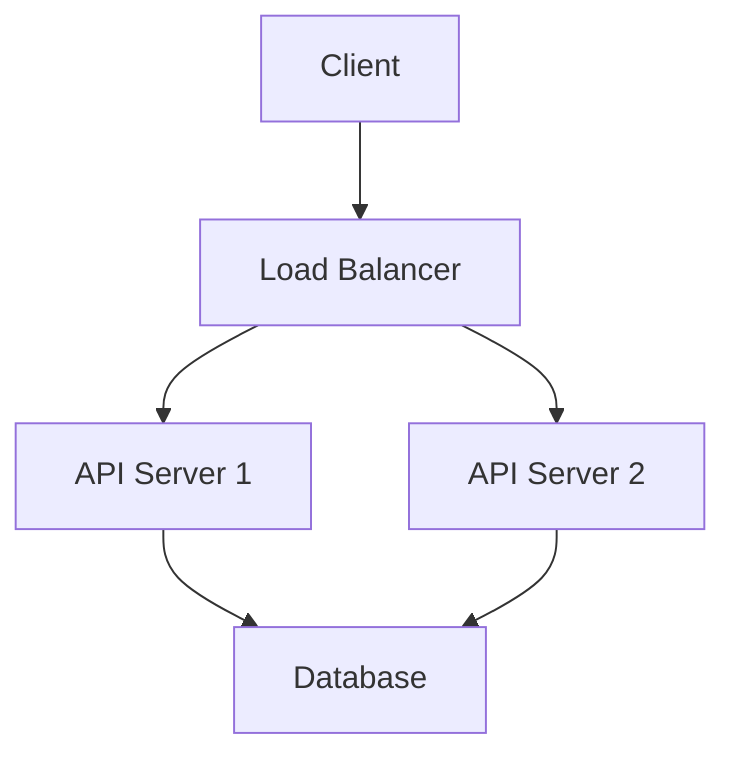
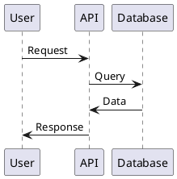

# Lesson 3: Diagrams and Visual Communication

## Learning Objectives

By the end of this lesson, you will be able to:
- Choose appropriate diagram types for different purposes
- Apply the C4 model for software architecture visualization
- Use diagrams-as-code tools (PlantUML, Mermaid)
- Follow accessibility and best practices for technical diagrams

---

## Introduction

A well-designed diagram can communicate complex architecture in seconds, while the same information in text might take minutes to parse. Visual communication is a crucial skill for technical leaders—diagrams clarify system design, facilitate discussions, and provide lasting documentation. However, poorly designed diagrams can confuse rather than clarify.

---

## Materials

### Primary Resource (30 minutes)

📺 **Video: C4 Architecture Model - Tech Primers**
- **Source:** Tech Primers - YouTube
- **URL:** https://www.youtube.com/watch?v=Tf3eNaB-LGs
- **Duration:** ~12 minutes
- **Focus:** Understanding C4 model layers: Context, Containers, Components, Code

📺 **Video: Cloud Architecture Diagrams - C4 Model**
- **Source:** Simon Brown (C4 Model creator) - YouTube
- **URL:** https://www.youtube.com/watch?v=ALuL9uKqWU4
- **Duration:** ~15 minutes
- **Focus:** Tips for better cloud architecture diagrams with C4

### Supplementary Resources (30 minutes)

📄 **Guide: C4 Model for Software Architecture**
- **Source:** C4 Model Official Site
- **URL:** https://c4model.com/
- **Focus:** Complete reference for the C4 model approach

📄 **Article: PlantUML vs Mermaid - Diagrams as Code**
- **Source:** Dan Does Code
- **URL:** https://www.dandoescode.com/blog/plantuml-vs-mermaid
- **Focus:** Comparing diagram-as-code tools for different use cases

📄 **Guide: Creating Diagrams for Documentation**
- **Source:** GitHub Docs
- **URL:** https://docs.github.com/en/contributing/writing-for-github-docs/creating-diagrams-for-github-docs
- **Focus:** Accessibility, file formats, and best practices

📄 **Guide: Technical Diagrams - IBM Design Language**
- **Source:** IBM Design
- **URL:** https://www.ibm.com/design/language/infographics/technical-diagrams/design
- **Focus:** Design principles for technical diagrams

---

## Key Concepts Summary

### The C4 Model

The C4 model provides a hierarchical approach to software architecture diagrams with four levels of zoom:

```
Level 1: System Context        (Highest level - for everyone)
    ↓
Level 2: Container             (High level - for technical teams)
    ↓
Level 3: Component             (Medium detail - for engineers)
    ↓
Level 4: Code                  (Lowest level - optional, often auto-generated)
```

**Level 1: System Context Diagram**
- Shows your system as a single box
- Displays external users (people/systems) it interacts with
- Audience: Everyone (executives, product, engineering)
- Purpose: Big picture overview

```
┌─────────┐
│  User   │
└────┬────┘
     │
     ↓
┌─────────────────┐          ┌──────────────┐
│   Our System    │─────────→│ Email System │
└─────────────────┘          └──────────────┘
     │
     ↓
┌─────────────────┐
│  Payment API    │
└─────────────────┘
```

**Level 2: Container Diagram**
- Zooms into your system
- Shows major deployable components (web app, API, database, mobile app)
- Includes technology choices
- Audience: Technical teams, architects
- Purpose: High-level technical architecture

```
┌─────────────────────────────────────────────┐
│           Our System                        │
│                                             │
│  ┌──────────────┐      ┌────────────────┐ │
│  │  Web App     │─────→│  REST API      │ │
│  │ (React)      │      │  (.NET Core)   │ │
│  └──────────────┘      └────────┬───────┘ │
│                                 │          │
│                                 ↓          │
│                        ┌────────────────┐  │
│                        │   Database     │  │
│                        │  (PostgreSQL)  │  │
│                        └────────────────┘  │
└─────────────────────────────────────────────┘
```

**Level 3: Component Diagram**
- Decomposes individual containers
- Shows internal components and modules
- Audience: Engineers working on the system
- Purpose: Understanding internal structure

```
┌───────────── REST API ─────────────────┐
│                                        │
│  ┌─────────────┐    ┌──────────────┐ │
│  │ Controllers │───→│   Services   │ │
│  └─────────────┘    └───────┬──────┘ │
│                              │         │
│                              ↓         │
│                     ┌──────────────┐  │
│                     │ Repositories │  │
│                     └──────────────┘  │
└─────────────────────────────────────────┘
```

**Level 4: Code Diagram**
- Shows classes, interfaces, methods
- Often auto-generated from code
- Audience: Developers (rare in documentation)
- Purpose: Deep implementation details

### When to Use Each C4 Level

```markdown
For executive review:           → Level 1 (System Context)
For architecture review:        → Levels 1 & 2 (Context + Container)
For new team member onboarding: → Levels 2 & 3 (Container + Component)
For implementation:             → Level 3 (Component)
For debugging complex code:     → Level 4 (Code) - if at all
```

### Other Essential Diagram Types

**Sequence Diagrams** - Show interactions over time:
```
User      API       Database    Payment
 │         │           │           │
 │─Request→│           │           │
 │         │──Query───→│           │
 │         │←─ Data ───│           │
 │         │───────── Charge ─────→│
 │         │←──────── Status ──────│
 │←─Response│          │           │
```

**Data Flow Diagrams** - Show how data moves:
```
[User Input] → [Validation] → [Transform] → [Database]
                    │
                    ↓
              [Error Log]
```

**State Diagrams** - Show state transitions:
```
[Draft] → [Review] → [Approved] → [Published]
   ↑         │           │
   │         ↓           │
   └──── [Rejected] ─────┘
```

### Diagrams as Code

**Why Use Diagrams as Code?**
- ✅ Version controlled alongside code
- ✅ Easy to update and maintain
- ✅ Reviewable in pull requests
- ✅ Consistent styling
- ❌ Steeper learning curve
- ❌ Less visual control

**Mermaid - Recommended for Most Use Cases**



**Advantages:**
- Renders natively in GitHub, GitLab, Azure DevOps
- JavaScript-based (runs in browser)
- No external dependencies
- Simpler syntax
- Great for documentation, READMEs, PRs

**Use Mermaid for:**
- Quick documentation
- README files
- Pull request descriptions
- Iterative diagrams
- Team wikis

**PlantUML - For Complex Diagrams**



**Advantages:**
- More diagram types
- Better UML coverage
- More control over layout
- Industry standard

**Use PlantUML for:**
- Formal architecture reviews
- Compliance documentation
- Complex UML diagrams
- Long-lived specifications

### Diagram Best Practices

**Accessibility:**
```markdown
✅ Do:
- Provide alt text for all diagrams
- Use sufficient color contrast
- Don't rely solely on color to convey meaning
- Include text descriptions alongside diagrams
- Use patterns/shapes in addition to colors

❌ Avoid:
- Text in images (use captions instead)
- Color as the only differentiator
- Tiny text that doesn't scale
- Overly complex diagrams
```

**Clarity:**
```markdown
✅ Do:
- Show clear starting points
- Use consistent styling
- Label all connections
- Keep diagrams focused (one concept per diagram)
- Use standard symbols when possible

❌ Avoid:
- Crossing lines unnecessarily
- Inconsistent arrow styles
- Ambiguous labels
- Information overload
- Decorative elements that don't add meaning
```

**File Formats:**
```markdown
Best → Worst:

1. SVG: Vector format, scales perfectly, accessible
   - Use when: Publishing documentation, web pages
   
2. PNG (high DPI): Raster format, good quality
   - Use when: SVG not supported

3. .drawio.png: Combines editable source + rendered image
   - Use when: Need to keep source and image together

4. JPG: Lossy compression, bad for diagrams
   - Avoid: Not suitable for technical diagrams
```

**Tool Recommendations by Use Case:**

```markdown
Quick documentation:          → Mermaid (in Markdown)
Architecture reviews:         → PlantUML or draw.io
Presentations:                → PowerPoint or draw.io → export SVG
Collaborative brainstorming:  → Miro or Mural
Formal specifications:        → PlantUML or Visio
```

### Example: Complete C4 Model Set

For a microservices e-commerce platform:

**Context (L1):**
```
[Customer] ← → [E-commerce Platform] ← → [Payment Provider]
                       ↕
                [Shipping Service]
```

**Container (L2):**
```
[Web App] ← → [API Gateway] ← → [Auth Service]
                   ↕
         [Order Service] + [DB]
                   ↕
      [Inventory Service] + [DB]
```

**Component (L3) - Order Service:**
```
[OrderController] → [OrderService] → [OrderRepository]
                         ↓
                    [PaymentClient]
                         ↓
                   [EventPublisher]
```

---

## Practice Exercise

After completing the materials (20-30 minutes):

1. **C4 Model Practice:**
   - Draw a System Context diagram for a system you've worked on
   - Create a Container diagram showing the major components
   - Identify what technologies are used in each container

2. **Diagrams-as-Code:**
   - Install Mermaid preview extension for VS Code
   - Create a sequence diagram showing a user login flow
   - Create a simple flowchart for an approval process

3. **Tool Exploration:**
   - Try both Mermaid and PlantUML for the same diagram
   - Compare ease of use and output quality
   - Decide which you'd use for different scenarios

4. **Accessibility Check:**
   - Take an existing diagram and add alt text
   - Verify color contrast meets WCAG standards
   - Add a text description that fully conveys the information
